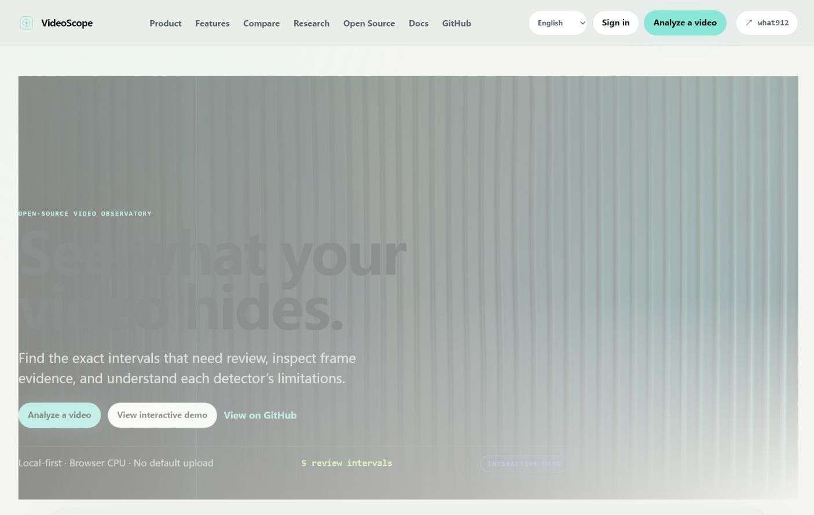

# VideoScope

**在本机把生成视频中的可疑黑场、冻结、相对模糊、亮度闪烁及可选
AI/OCR 一致性信号定位到具体时间区间，并生成可审查证据。**

VideoScope 是 local-first 工具：默认不上传视频、提示词、证据帧或报告，
没有遥测，也不会自动下载模型。项目身份为：

- 公开源码仓库（候选）：`https://github.com/what912/VideoScope`
- 公开浏览器站点（候选）：`https://what912.github.io/VideoScope/`
- PyPI distribution：`genvideoscope`
- Python import：`videoscope`
- CLI：`videoscope`

> **部署状态（2026-07-30）：尚未部署。** 上述 GitHub Pages 地址是已配置
> 的候选生产地址；本仓库当前只完成本地构建与部署工作流，未执行
> `git push`、GitHub Pages 部署、Supabase 生产配置或 PyPI 发布。

```powershell
# 在源码 checkout 根目录安装
python -m pip install .

# 最小分析
videoscope analyze input.mp4 --output runs/example
```

默认 CPU profile 包含四个 detector：

- `near_black`：持续近黑区间；
- `possible_freeze`：疑似冻结或连续近重复帧；
- `scene_relative_blur`：场景内相对清晰度下降；
- `global_flicker`：排除切镜邻域后的潜在全局亮度闪烁。

## 公开浏览器体验

`site/` 是面向 GitHub Pages 的双语浏览器产品站。匿名用户无需注册即可
选择本地视频，在浏览器中运行四个有界 CPU 启发式 detector：
`near_black`、`possible_freeze`、`scene_relative_blur` 和
`global_flicker`。本地文件分析不会上传原视频；报告默认保存在当前
浏览器的 IndexedDB 中。

浏览器站点还包含：

- 英文/简体中文切换，语言偏好保存在当前浏览器；
- 固定、不随语言切换的创作者标识 `what912`；
- 本地工作台、detector 对比和 Creator/Research 报告视图；
- JSON 下载，以及通过浏览器“打印 / 另存为 PDF”的打印布局；
- 可选 Supabase 登录和脱敏分享接口；未配置时明确显示不可用，匿名分析
  不受影响。

浏览器预览不是桌面 CLI 的替代品：它依赖浏览器编解码器和 Canvas，
按受控采样运行，不使用 FFmpeg/ffprobe，不提供 Benchmark、AI/OCR
provider、Web API 或经过校准的准确率。直接 URL 导入会在同意后联系
用户输入的 HTTPS 主机，并可能受 CORS 限制。详情见
[公开站点说明](docs/public-site.md)和
[前端开发说明](docs/frontend.md)。



> 该截图来自本地生产构建的首页，仅证明页面渲染，不是 detector
> Benchmark、真实 fixture 分析或线上部署证据。


> 截图使用明确标注的 mock report，仅展示界面结构，不代表 Benchmark、
> 真实视频准确率或伪造检测结果。

## 输出

一次成功分析通常生成：

```text
runs/example/
├── report.json
├── report.html
└── evidence/
    ├── finding_<hash>_00.jpg
    ├── finding_<hash>_01.jpg
    └── finding_<hash>_02.jpg
```

终端输出示例：

```text
Computing input hash
Probing video metadata
Sampling analysis frames
Detecting scene boundaries
Running detectors
Materializing evidence frames
Building analysis report
Rendering offline HTML report
Analysis complete
```

`report.json` 是事实来源。`report.html` 只渲染已校验的报告模型，不重新
检测或改变结论，且不加载 CDN、远程字体或统计脚本。

## 系统要求

- Python 3.11 或 3.12；
- Windows、Linux 或 macOS；
- 可从 `PATH` 调用的 `ffmpeg` 和 `ffprobe`；
- CPU 基础版不要求 GPU、Node.js、网络服务或 AI 模型；
- 开发 Dashboard 时需要 Node.js 22 或其他满足 Vite 版本要求的版本。

检查环境：

```powershell
python --version
ffmpeg -version
ffprobe -version
videoscope doctor
```

VideoScope 不捆绑或自动安装 FFmpeg。请从
[FFmpeg 官方下载入口](https://ffmpeg.org/download.html)选择平台构建，
并检查该构建自身的许可证配置。常见系统安装命令：

```bash
# Ubuntu / Debian
sudo apt-get update
sudo apt-get install ffmpeg

# macOS（Homebrew）
brew install ffmpeg
```

## 安装

源码安装：

```powershell
python -m venv .venv
.\.venv\Scripts\Activate.ps1
python -m pip install .
videoscope --version
```

Linux/macOS 激活虚拟环境使用：

```bash
source .venv/bin/activate
```

开发安装与统一验证：

```powershell
python -m pip install -e ".[dev]"
python scripts/verify.py
```

构建并安装本地候选 wheel：

```powershell
python -m build
python -m pip install dist/genvideoscope-0.2.0rc1-py3-none-any.whl
```

正式上传 PyPI 后，用户安装命令将是：

```text
python -m pip install genvideoscope
```

本仓库不会自动执行该发布操作。

## CLI

```text
videoscope --help
videoscope doctor
videoscope models list
videoscope models doctor
videoscope analyze INPUT --output runs/example
videoscope benchmark MANIFEST --output runs/benchmark
videoscope serve
```

常用分析选项：

- `--prompt TEXT`：把用户明确提供的本地提示词记录进报告；
- `--sample-fps FLOAT`：设置固定抽样率；
- `--detector ID`：只运行指定 detector，可重复；
- `--disable-detector ID`：禁用 detector，可重复；
- `--config FILE`：加载 UTF-8 JSON 配置；
- `--json-only`：只生成 JSON；
- `--open-report`：成功后打开本地 HTML；
- `--bundle-video`：明确复制完整源视频到报告目录；
- `--keep-workspace`：保留抽样帧，适合调试而非普通使用。

退出码：

| 代码 | 含义 |
| --- | --- |
| `0` | 分析完成；存在 Finding 仍是成功 |
| `2` | 输入、路径或配置错误 |
| `3` | 视频无法探测或处理 |
| `4` | 内部流水线或报告失败 |
| `130` | 用户中断或取消 |

## 配置

CLI 当前读取严格 JSON。仓库中的
[`examples/config.example.yaml`](examples/config.example.yaml) 使用 JSON
语法子集，因此同时是合法 YAML，也能直接交给当前 JSON 解析器：

```powershell
videoscope analyze input.mp4 `
  --config examples/config.example.yaml `
  --output runs/configured
```

未知字段、未知 detector 和越界阈值会被拒绝。报告会记录实际生效参数。

## Python API

```python
from pathlib import Path

from videoscope.analysis import AnalysisConfig, AnalysisPipeline

config = AnalysisConfig(
    sample_fps=2.0,
    output_directory=Path("runs/python-api"),
)
result = AnalysisPipeline(config).run(Path("input.mp4"))

for finding in result.report.findings:
    print(
        finding.detector_id,
        finding.time_range.start_seconds,
        finding.time_range.end_seconds,
        finding.severity,
    )
```

更多可执行示例：

- [`examples/basic_cli.ps1`](examples/basic_cli.ps1)
- [`examples/basic_cli.sh`](examples/basic_cli.sh)
- [`examples/batch_analysis.py`](examples/batch_analysis.py)
- [`examples/custom_detector.py`](examples/custom_detector.py)

## 可选 AI 与 OCR

CPU 基础安装不会安装或导入 Torch、OpenCLIP、PaddleOCR 或
PaddlePaddle。源码 checkout 中的可选安装组：

```text
python -m pip install ".[ai]"
python -m pip install ".[ocr]"
python -m pip install ".[web]"
python -m pip install ".[all]"
```

PyPI 发布后对应命令使用 `genvideoscope[ai]`、
`genvideoscope[ocr]`、`genvideoscope[web]` 或
`genvideoscope[all]`。

可选 detectors：

| Detector | 信号 | 重要限制 |
| --- | --- | --- |
| `prompt_alignment` | OpenCLIP prompt/frame 相似度 | 不能完整理解否定、数量、动作和空间关系 |
| `visual_semantic_drift` | 场景内 embedding 突变 | 不是身份识别；运动、遮挡和光照可能误报 |
| `text_stability` | 场景内 OCR 文字轨迹不稳定 | OCR 自身错误可能造成误报 |

安装 extra 不等于授权模型下载。首次下载必须交互确认；非交互运行必须
显式传入 `--allow-model-download`。例如：

```powershell
videoscope analyze input.mp4 `
  --prompt "A red car driving through snow" `
  --enable-ai `
  --detector prompt_alignment `
  --output runs/prompt-alignment
```

这些输出仍是 detector 内部的启发式信号，不是校准后的正确率、身份判断
或跨 detector 总质量分。参见
[模型运行时](docs/model-runtime.md)和
[detector 文档](docs/detectors)。

## 本地 Web Dashboard

```powershell
python -m pip install ".[web]"
cd web
npm install
npm test
npm run build
cd ..
videoscope serve
```

默认绑定 `127.0.0.1`，端口 `0` 由操作系统选择。Dashboard 位于 `/`，
本地 API 文档位于 `/docs`。非回环绑定必须显式使用
`--allow-network`；这会扩大信任边界，服务没有用户账户或身份认证。

API 对单文件上传、配置和 prompt 设有上限，通过 ffprobe 最终验证媒体，
使用随机作业 ID、受控 artifact 路径、独立 worker pool 和过期清理。
前端和 API 复用同一个 `AnalysisPipeline`。

参见 [Dashboard 开发说明](docs/frontend.md)和
[Web API](docs/web-api.md)。

## Benchmark

```powershell
python scripts/generate_test_videos.py --force
videoscope benchmark tests/fixtures/manifest.json --output runs/benchmark
```

Benchmark 分 detector 报告 temporal IoU、event precision/recall/F1、起止
时间误差和负样本误报，不合成全局分数。Synthetic fixtures 只是工程回归
集，不代表真实生成视频准确率。真实标注集与 split 要求见
[Benchmark 文档](docs/benchmarking.md)。

## 隐私与安全

- 默认只读源视频并在本地运行；
- 默认不复制完整视频，只有 `--bundle-video` 会复制；
- 报告不记录工作区或个人绝对目录；
- 用户提供的文件名、prompt、输入 SHA-256、时间元数据和证据帧仍可能
  具有隐私性，分享报告前必须人工复核；
- Web 默认只接受可信回环 Host 和回环浏览器 Origin；
- 外部命令使用参数数组，不使用 `shell=True`；
- 单 detector 失败记录为 `detector_error`，不会伪装成“没有问题”。

安全问题请阅读 [SECURITY.md](SECURITY.md)。公开 Issue 前请移除视频、
声音、人物、prompt、绝对路径、嵌入元数据和其他私人内容。

## 已知限制

- CPU 与 AI/OCR detector 都是启发式，不是对故障或创作意图的证明；
- 静态镜头、夜景、淡出、柔焦、低纹理和节奏灯光可能产生误报；
- 固定抽样可能漏掉采样点之间的短事件；
- 镜头边界误差会影响场景内基线；
- FFmpeg、OpenCV 和模型版本差异可能带来数值变化；
- Prompt 相似度不能完整验证复杂语义；
- 视觉语义漂移不是人物或角色身份识别；
- OCR 错误可能看起来像文字不稳定；
- 未在真实独立标注集上校准，不提供统一总质量分；
- Web API 没有账户系统；`--allow-network` 只适合受信网络。

详细算法与限制见 [算法说明](docs/algorithm-notes.md)。

## Roadmap

v0.2.0 候选已包括共享 AI runtime、三个可选 AI/OCR detector、本地 Web
API 和 React Dashboard。后续方向是：

- 独立真实标注集校准和性能基准；
- 更严格的 schema 迁移机制；
- 可插拔但显式授权的数据提供方；
- 批量分析与模型对比工作流。

视频生成、自动修复、人脸身份识别、未经校准的统一总分和默认外部上传
仍不是产品目标。

## 贡献与发布

贡献前阅读 [CONTRIBUTING.md](CONTRIBUTING.md) 和
[AGENTS.md](AGENTS.md)。提交前运行：

```powershell
python scripts/validate.py
python -m build
python scripts/audit_distribution.py dist
cd web
npm test
npm run build
```

发布检查见 [docs/release-checklist.md](docs/release-checklist.md)，本次审计
结论见 [release-audit.md](release-audit.md)。

## 许可证与引用

项目代码采用 Apache-2.0，见 [LICENSE](LICENSE)。FFmpeg 是外部系统
依赖，不随 wheel 分发。直接第三方依赖与许可证见
[NOTICE](NOTICE)和
[第三方许可证清单](docs/third-party-licenses.md)。研究引用元数据见
[CITATION.cff](CITATION.cff)。
