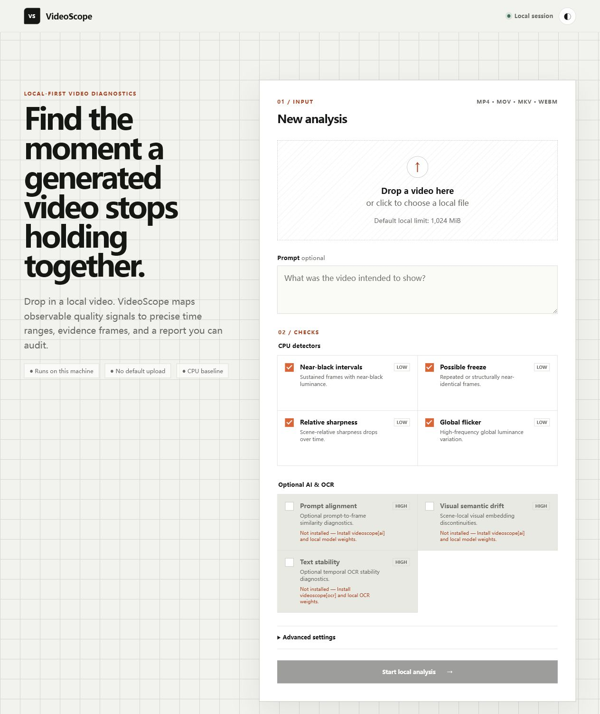

# VideoScope

**Find what is wrong, make a reviewed local fix, and keep every frame traceable.**

VideoScope is an open-source, local-first video observatory by **what912**. Drop
in a video to diagnose visible problems, prepare a publish-compatible copy,
review privacy risks, rescue observable playback defects, or turn a long
recording into useful chapters and clips. The base path runs on CPU, never
uploads by default, and never overwrites the source.

**Use the browser CPU analyzer:** https://what912.github.io/VideoScope/

**Source, issues and contributions:** https://github.com/what912/VideoScope

The public site provides an immediate browser CPU scan. To unlock every local
workflow without creating a VideoScope cloud bill, install the Windows
connector once. The release installer includes the application runtime, starts
a visible local connector, checks FFmpeg/ffprobe and opens the pairing page—no
Python command is required:

1. Open [`/VideoScope/connect`](https://what912.github.io/VideoScope/connect).
2. Download `VideoScope-Setup-x64.exe` from the official `what912/VideoScope`
   Release and verify its SHA-256 file.
3. Double-click the installer and keep “Launch VideoScope Local Connector”
   selected.
4. Copy the one-time code shown in the connector window, pair the browser, then
   drop in a video.

The installer is attached only after its Windows CI install/start/uninstall
smoke passes. Until that verified Release asset is present, developers can use
the source fallback:

```powershell
git clone https://github.com/what912/VideoScope.git
cd VideoScope
py -3.11 -m venv .venv
.\.venv\Scripts\Activate.ps1
python -m pip install -e ".[web]"
videoscope doctor
videoscope serve
```

Keep that terminal open, then visit the connect page, enter the short pairing
code printed by the connector, and open any A/B/C/D workflow. The complete
zero-beginner walkthrough, troubleshooting and uninstall steps are in the
[Windows installation guide](docs/windows-install.md).
The connector binds only to `127.0.0.1:8765`; videos and working files remain on
the user's computer.

The optional account on the public site is an encrypted **device account**. It
unlocks that browser's local workspace and supports encrypted backup/import,
but it is deliberately not a cloud-sync account and has no server-side password
recovery. Anonymous browser analysis remains available.

Users can also configure a compatible AI provider in the loopback workbench.
Their API Key is kept only in connector process memory, is cleared on exit, and
is never accepted by the public site. Any provider charge belongs to the user's
own provider account. Provider presets are compatibility helpers, not a promise
that every branded model or media service implements the same API.

Or run a first diagnosis directly:

```powershell
videoscope analyze input.mp4 --output runs\first-check
```

| Mode | Practical result |
| --- | --- |
| **Check** | JSON + offline HTML with exact issue ranges and evidence frames |
| **A · Publish Ready** | New verified MP4 for common horizontal/vertical delivery |
| **D · Safe Sharing** | Human-reviewed privacy-redacted sharing copy |
| **B · Video Rescue** | Automatic issue localization, content-faithful cleanup, and bounded viewing improvement |
| **C · Useful Content** | Reviewed chapters, selected clips, source map and report |

Advanced AI is optional: trusted transcript or explicitly approved Faster
Whisper ASR plus either loopback Ollama or a user-funded OpenAI-compatible
provider can propose grounded chapters, highlights, summaries and titles.
Remote use requires per-run data-transfer consent. Suggestions start rejected
and cannot bypass human review, C's private preview, exact confirmation or final
verification. See [Advanced AI setup and trust boundaries](docs/advanced-ai.md)
and the [zero-cost/BYOK architecture](docs/zero-cost-access.md).

> GitHub Pages is the public entry, not a hidden video-processing cloud.
> Python/FFmpeg, long-video workflows, optional models and BYOK requests run
> through the user's paired loopback connector.

## C · Long Video to Useful Content / 长视频变成有用成品

VideoScope can turn an existing local long video into a reviewable, traceable
result without uploading it or asking an AI model to invent what matters. Pick
one of three CPU workflows: **Faithful Clean** removes only exact reviewed
intervals, **Chaptered Full** preserves the complete timeline and adds chapters,
and **Selected Clips** exports the exact moments you choose.

VideoScope 可以把本地长视频整理成可复核、可追溯的成品，全程默认不上
传，也不让模型擅自决定“什么重要”。三种 CPU 目标分别是：**忠实精简**
（只移除人工确认的精确区间）、**完整分章**（不删内容，只增加章节）和
**选定片段**（只导出用户明确选择的时刻）。

```powershell
python -m pip install https://github.com/what912/VideoScope/releases/download/v0.8.2/genvideoscope-0.8.2-py3-none-any.whl
videoscope content meeting.mp4 `
  --goal faithful_clean `
  --exclude-range 120:148:"Long reviewed pause" `
  --locked-keep-range 132:138:"Keep surrounding context" `
  --output runs\useful-content
```

The first run writes a private content map, storyboard, exact action ranges and
bounded join previews. Review those artifacts, then confirm the exact plan shown
by the CLI or local Web workbench. A verified result contains
`useful-content.mp4`, `source-map.json`, `changes.json`, chapter data and an
offline report under `content-output/`. The source file remains byte-for-byte
unchanged. Optional local SRT/WebVTT is private unless subtitle export is
explicitly selected.

Read the [workflow guide](docs/long-video-content.md) and stable
[content schema](docs/content-schema.md). This CPU MVP does not transcribe,
summarize, rank highlights, generate titles, or perform creative editing; it
fails closed when a preview, confirmation binding, source map or required media
verification is incomplete.

## Video Rescue: preview, confirm, then create a new local copy

Video Rescue is an opt-in, CPU-only workflow for observable container, timeline,
video, and audio problems. It never overwrites the source. Install the base wheel
and provide local `ffmpeg` and `ffprobe` on `PATH`:

```powershell
python -m pip install https://github.com/what912/VideoScope/releases/download/v0.8.2/genvideoscope-0.8.2-py3-none-any.whl
videoscope doctor
videoscope rescue input.mp4 `
  --output runs\video-rescue `
  --strategy balanced `
  --symptom dark `
  --symptom video_noise
```

`conservative` prioritizes faithful remux/timeline/stream salvage and avoids
subjective enhancement. `balanced` includes Conservative behavior and may propose
bounded luma, denoise, sharpen, deflicker, stabilization, loudness, audio denoise,
or fixed A/V-offset actions only when local measurements support them. Symptom
hints guide assessment; they do not authorize a filter by themselves.

Before full processing, VideoScope creates same-range source/faithful/improved
previews under the private review root and displays a deterministic plan digest.
Interactive use asks for confirmation; automation must supply that exact digest
with `--confirm-plan`. Successful public artifacts are placed in
`rescue-output/`: `faithful-rescue.mp4`, an optional independent
`improved-viewing.mp4`, plan/damage/change/verification/technical JSON, and an
offline `report.html`. A `partial` result includes precise unrecovered source
ranges; `needs_review` is not completion.

For confirmed Balanced cleanup, both delivered video files independently retain
the bounded denoise, sharpening, and stabilization work. The improved-viewing
file inherits those repairs rather than applying them a second time.

Filtering may improve observable playback, but it cannot recreate missing source
frames, clipped audio samples, or image detail that was never recorded or has been
destroyed. Reports, previews, hashes, and derivatives may be sensitive. The local
Web workflow is available through `python -m videoscope serve`; keep the default
loopback binding, review both languages and the full result, then use explicit job
deletion (or delete the complete CLI output directory) when retention is no longer
needed.

See the [Video Rescue guide](docs/video-rescue-guide.md), the versioned
[Rescue JSON schema](docs/rescue-schema.md), and the PowerShell/POSIX examples in
`examples/`.

**在本机定位视频质量异常，并把经过人工复核的隐私区域处理成一个独立、
可验证的分享副本。**

VideoScope 是 local-first 工具：默认不上传视频、提示词、证据帧或报告，
没有遥测，也不会自动下载模型。公开发行采用独特名称：

- GitHub 仓库：`GenVideoScope`
- PyPI distribution：`genvideoscope`
- Python import：`videoscope`
- CLI：`videoscope`

```powershell
# 在源码 checkout 根目录安装
python -m pip install .

# 先扫描隐私风险；此命令只写入私有复核区，不修改视频
videoscope privacy input.mp4 `
  --output runs\safe-sharing `
  --audience public `
  --scan-only
```

默认 CPU profile 包含四个 detector：

- `near_black`：持续近黑区间；
- `possible_freeze`：疑似冻结或连续近重复帧；
- `scene_relative_blur`：场景内相对清晰度下降；
- `global_flicker`：排除切镜邻域后的潜在全局亮度闪烁。



> 截图使用明确标注的 mock report，仅展示界面结构，不代表 Benchmark、
> 真实视频准确率或伪造检测结果。

## Safe Sharing：复核后再生成分享副本

`videoscope privacy` 是 v0.4 开发线中的本地、CPU-first、显式选择工作流。
它检查可移除元数据，提出匿名人脸区域、QR/条码区域和可选 OCR 文字区域，
也接受人工画框与静音区间。自动扫描只提供启发式建议；它不识别人是谁，
不保证发现全部敏感内容，也不证明输出在所有场景中绝对安全。

完整生命周期分为三次明确操作：

```powershell
# 1. 扫描；源视频只读，风险图只写入 privacy-review-private
videoscope privacy input.mp4 --output runs\safe-sharing --scan-only

# 2. 用当前 risk-map 中的真实 risk_id 填写复核文件，生成私有预览和摘要
videoscope privacy input.mp4 `
  --output runs\safe-sharing `
  --review-file review.json `
  --preview-only

# 3. 人工比较源视频与预览后，提交上一步打印的完整摘要
videoscope privacy input.mp4 `
  --output runs\safe-sharing `
  --confirm-digest REPLACE_WITH_EXACT_PLAN_DIGEST
```

私有目录 `privacy-review-private/` 可能包含未脱敏证据、风险图、计划和预览，
不能分享。只有确认并完成独立检查后，`share-package/` 才包含固定白名单中的
`share-safe.mp4` 和脱敏 JSON。若必需检查无法完成，结果是 `needs_review`，
不会伪装成已完成，也不会生成或授权下载公开分享包。任务结束后可在 Web 工作台显式删除本地任务；CLI 用户应在
确认不再需要复核材料后删除整个输出目录。

OCR 不是基础依赖。未安装或未启用 OCR 时，界面会明确要求人工文字复核；
不会下载模型，也不会把“未扫描”写成“没有风险”。详细契约见
[Safe Sharing 指南](docs/safe-sharing.md)、[隐私 schema](docs/privacy-schema.md)
和 [Web API](docs/privacy-api.md)。

## Publish Ready：先看计划，再生成发布副本

`videoscope publish` 是可选的本地 Resolve 流程。它先探测源视频、显示确定性
处理计划并生成最多 6 秒的本地预览；交互终端会在执行完整处理前要求确认。源文件
始终只读，结果写入新的输出目录。已经人工审查计划的自动化任务可以显式使用
`--yes`：

```powershell
videoscope publish input.mp4 `
  --profile compatible_mp4 `
  --output runs\publish-ready `
  --yes
```

三个 Profile 均输出 MP4/H.264/yuv420p，并在源视频含音频时保留为 AAC：

| Profile | 用途 | 画布 |
| --- | --- | --- |
| `compatible_mp4` | 保持源尺寸的通用兼容副本 | 源尺寸 |
| `social_vertical_9_16` | 竖屏社交画布 | 1080×1920 |
| `social_horizontal_16_9` | 横屏社交画布 | 1920×1080 |

竖屏和横屏 Profile 使用等比缩放与黑边填充（scale-and-pad），不会裁掉源画面。
成功目录包含 `publish-ready.mp4`、`cover.jpg`、`changes.json` 和
`technical-report.json`，并保留 `plan.json`、预览和处理前后诊断报告。若文件已
生成但技术验证要求人工复核，命令退出码为 `5`，不得把该状态当作已通过。

Publish Ready 不上传素材、不访问远程处理服务，也不需要 GPU 或模型。它需要系统
`PATH` 中的 FFmpeg/ffprobe，并要求 FFmpeg 构建支持 H.264 (`libx264`) 和 AAC
编码。技术验证只检查所选 Profile 的当前可观测要求；它不证明艺术质量，也不保证
未来平台规则或所有播放器环境永久兼容。详见
[Publish Ready 契约](docs/publish-ready.md)。

## 输出

一次成功分析通常生成：

```text
runs/example/
├── report.json
├── report.html
└── evidence/
    ├── finding_<hash>_00.jpg
    ├── finding_<hash>_01.jpg
    └── finding_<hash>_02.jpg
```

终端输出示例：

```text
Computing input hash
Probing video metadata
Sampling analysis frames
Detecting scene boundaries
Running detectors
Materializing evidence frames
Building analysis report
Rendering offline HTML report
Analysis complete
```

`report.json` 是事实来源。`report.html` 只渲染已校验的报告模型，不重新
检测或改变结论，且不加载 CDN、远程字体或统计脚本。

## 系统要求

- Python 3.11 或 3.12；
- Windows、Linux 或 macOS；
- 可从 `PATH` 调用的 `ffmpeg` 和 `ffprobe`；
- CPU 基础版不要求 GPU、Node.js、网络服务或 AI 模型；
- 开发 Dashboard 时需要 Node.js 22 或其他满足 Vite 版本要求的版本。

检查环境：

```powershell
python --version
ffmpeg -version
ffprobe -version
videoscope doctor
```

VideoScope 不捆绑或自动安装 FFmpeg。请从
[FFmpeg 官方下载入口](https://ffmpeg.org/download.html)选择平台构建，
并检查该构建自身的许可证配置。常见系统安装命令：

```bash
# Ubuntu / Debian
sudo apt-get update
sudo apt-get install ffmpeg

# macOS（Homebrew）
brew install ffmpeg
```

## 安装

安装当前已发布的稳定版（currently published stable `v0.8.2` release）：

```powershell
python -m pip install https://github.com/what912/VideoScope/releases/download/v0.8.2/genvideoscope-0.8.2-py3-none-any.whl
videoscope doctor
```

源码安装：

```powershell
python -m venv .venv
.\.venv\Scripts\Activate.ps1
python -m pip install .
videoscope --version
```

Linux/macOS 激活虚拟环境使用：

```bash
source .venv/bin/activate
```

开发安装与统一验证：

```powershell
python -m pip install -e ".[dev]"
python scripts/validate.py
```

构建并安装本地 wheel：

```powershell
python -m build
python -m pip install dist/genvideoscope-0.8.2-py3-none-any.whl
```

也可从 PyPI 安装同一精确版本：

```text
python -m pip install genvideoscope==0.8.2
```

PyPI distribution 名称为 `genvideoscope`；Python import 和 CLI 名称仍为
`videoscope`。发布记录见 [PyPI 0.8.2](https://pypi.org/project/genvideoscope/0.8.2/)。

## CLI

```text
videoscope --help
videoscope doctor
videoscope models list
videoscope models doctor
videoscope analyze INPUT --output runs/example
videoscope publish INPUT --profile compatible_mp4 --output runs/publish-ready
videoscope privacy INPUT --output runs/safe-sharing --scan-only
videoscope benchmark MANIFEST --output runs/benchmark
videoscope serve
```

常用分析选项：

- `--prompt TEXT`：把用户明确提供的本地提示词记录进报告；
- `--sample-fps FLOAT`：设置固定抽样率；
- `--detector ID`：只运行指定 detector，可重复；
- `--disable-detector ID`：禁用 detector，可重复；
- `--config FILE`：加载 UTF-8 JSON 配置；
- `--json-only`：只生成 JSON；
- `--open-report`：成功后打开本地 HTML；
- `--bundle-video`：明确复制完整源视频到报告目录；
- `--keep-workspace`：保留抽样帧，适合调试而非普通使用。

退出码：

| 代码 | 含义 |
| --- | --- |
| `0` | 分析完成；存在 Finding 仍是成功 |
| `2` | 输入、路径或配置错误 |
| `3` | 视频无法探测或处理 |
| `4` | 内部流水线或报告失败 |
| `5` | Publish Ready 产物存在，但验证要求人工复核 |
| `130` | 用户中断或取消 |

## 配置

CLI 当前读取严格 JSON。仓库中的
[`examples/config.example.yaml`](examples/config.example.yaml) 使用 JSON
语法子集，因此同时是合法 YAML，也能直接交给当前 JSON 解析器：

```powershell
videoscope analyze input.mp4 `
  --config examples/config.example.yaml `
  --output runs/configured
```

未知字段、未知 detector 和越界阈值会被拒绝。报告会记录实际生效参数。

## Python API

```python
from pathlib import Path

from videoscope.analysis import AnalysisConfig, AnalysisPipeline

config = AnalysisConfig(
    sample_fps=2.0,
    output_directory=Path("runs/python-api"),
)
result = AnalysisPipeline(config).run(Path("input.mp4"))

for finding in result.report.findings:
    print(
        finding.detector_id,
        finding.time_range.start_seconds,
        finding.time_range.end_seconds,
        finding.severity,
    )
```

更多可执行示例：

- [`examples/basic_cli.ps1`](examples/basic_cli.ps1)
- [`examples/basic_cli.sh`](examples/basic_cli.sh)
- [`examples/batch_analysis.py`](examples/batch_analysis.py)
- [`examples/custom_detector.py`](examples/custom_detector.py)
- [`examples/safe_sharing.ps1`](examples/safe_sharing.ps1)
- [`examples/safe_sharing.sh`](examples/safe_sharing.sh)
- [`examples/privacy-review.example.json`](examples/privacy-review.example.json)

## 可选 AI 与 OCR

CPU 基础安装不会安装或导入 Torch、OpenCLIP、PaddleOCR 或
PaddlePaddle。源码 checkout 中的可选安装组：

```text
python -m pip install ".[ai]"
python -m pip install ".[ocr]"
python -m pip install ".[web]"
python -m pip install ".[all]"
```

PyPI 发布后对应命令使用 `genvideoscope[ai]`、
`genvideoscope[ocr]`、`genvideoscope[web]` 或
`genvideoscope[all]`。

可选 detectors：

| Detector | 信号 | 重要限制 |
| --- | --- | --- |
| `prompt_alignment` | OpenCLIP prompt/frame 相似度 | 不能完整理解否定、数量、动作和空间关系 |
| `visual_semantic_drift` | 场景内 embedding 突变 | 不是身份识别；运动、遮挡和光照可能误报 |
| `text_stability` | 场景内 OCR 文字轨迹不稳定 | OCR 自身错误可能造成误报 |

安装 extra 不等于授权模型下载。首次下载必须交互确认；非交互运行必须
显式传入 `--allow-model-download`。例如：

```powershell
videoscope analyze input.mp4 `
  --prompt "A red car driving through snow" `
  --enable-ai `
  --detector prompt_alignment `
  --output runs/prompt-alignment
```

这些输出仍是 detector 内部的启发式信号，不是校准后的正确率、身份判断
或跨 detector 总质量分。参见
[模型运行时](docs/model-runtime.md)和
[detector 文档](docs/detectors)。

## 本地 Web Dashboard

```powershell
python -m pip install ".[web]"
cd web
npm install
npm test
npm run build
cd ..
videoscope serve
```

默认绑定 `127.0.0.1:8765`，便于公开网站稳定发现本地连接器。Dashboard 位于 `/`，
本地 API 文档位于 `/docs`。非回环绑定必须显式使用
`--allow-network`；这会扩大信任边界，服务没有用户账户或身份认证。

API 对单文件上传、配置和 prompt 设有上限，通过 ffprobe 最终验证媒体，
使用随机作业 ID、受控 artifact 路径、独立 worker pool 和过期清理。
前端和 API 复用 Python 核心流水线；Safe Sharing 复用同一个
`SafeSharingPipeline`，并支持风险时间轴、人工视觉/音频区域、私有预览、
精确摘要确认、恢复、取消、结果下载和显式删除。

参见 [Dashboard 开发说明](docs/frontend.md)和
[Web API](docs/web-api.md)。

## Benchmark

```powershell
python scripts/generate_test_videos.py --force
videoscope benchmark tests/fixtures/manifest.json --output runs/benchmark
```

Benchmark 分 detector 报告 temporal IoU、event precision/recall/F1、起止
时间误差和负样本误报，不合成全局分数。Synthetic fixtures 只是工程回归
集，不代表真实生成视频准确率。真实标注集与 split 要求见
[Benchmark 文档](docs/benchmarking.md)。

## 隐私与安全

- 默认只读源视频并在本地运行；
- 默认不复制完整视频，只有 `--bundle-video` 会复制；
- 报告不记录工作区或个人绝对目录；
- Safe Sharing 的公开包与私有复核目录物理分离，公开下载采用固定白名单；
- Safe Sharing 在任何媒体修改前要求人工复核、私有预览和精确计划摘要；
- 用户提供的文件名、prompt、输入 SHA-256、时间元数据和证据帧仍可能
  具有隐私性，分享报告前必须人工复核；
- Web 默认只接受可信回环 Host 和回环浏览器 Origin；
- 外部命令使用参数数组，不使用 `shell=True`；
- 单 detector 失败记录为 `detector_error`，不会伪装成“没有问题”。

安全问题请阅读 [SECURITY.md](SECURITY.md)。公开 Issue 前请移除视频、
声音、人物、prompt、绝对路径、嵌入元数据和其他私人内容。

## 已知限制

- CPU 与 AI/OCR detector 都是启发式，不是对故障或创作意图的证明；
- 静态镜头、夜景、淡出、柔焦、低纹理和节奏灯光可能产生误报；
- 固定抽样可能漏掉采样点之间的短事件；
- 镜头边界误差会影响场景内基线；
- FFmpeg、OpenCV 和模型版本差异可能带来数值变化；
- Prompt 相似度不能完整验证复杂语义；
- 视觉语义漂移不是人物或角色身份识别；
- OCR 错误可能看起来像文字不稳定；
- 未在真实独立标注集上校准，不提供统一总质量分；
- Web API 没有账户系统；`--allow-network` 只适合受信网络。
- Publish Ready 当前只提供三个版本化 Profile，使用本地 FFmpeg 生成兼容副本；
  它不做自动剪辑、插帧、稳定、生成式增强或艺术质量修复。
- 不同 FFmpeg 编码器配置、VFR 输入、长视频资源消耗和目标平台播放器行为需要在
  实际目标环境复核；当前 Profile 规则不是对未来平台要求的永久承诺。
- Safe Sharing 的匿名区域、QR/条码和文字扫描都是启发式；遮挡、运动、低分辨率、
  OCR 错误和采样间隔都可能造成漏检或误报，最终分享前必须人工播放和复核。
- CPU MVP 不自动识别敏感语音；音频隐私依赖用户人工标记静音区间。

详细算法与限制见 [算法说明](docs/algorithm-notes.md)。

## Roadmap

The immutable `0.8.2` release packages the merged Video Rescue full-output flow
correction and its six verified assets. The base installation remains
local-first, CPU-only and model-free. 后续方向是：

- 独立真实标注集校准和性能基准；
- 更严格的 schema 迁移机制；
- 可插拔但显式授权的数据提供方；
- 批量分析与模型对比工作流。

视频生成、自动修复、人脸身份识别、未经校准的统一总分和默认外部上传
仍不是产品目标。

## 贡献与发布

贡献前阅读 [CONTRIBUTING.md](CONTRIBUTING.md) 和
[AGENTS.md](AGENTS.md)。提交前运行：

```powershell
python scripts/validate.py
python -m build
python scripts/audit_distribution.py dist
cd web
npm test
npm run build
```

已发布且不可变的 `v0.8.2` 记录见
[docs/releases/v0.8.2-checklist.md](docs/releases/v0.8.2-checklist.md)；上一版
`v0.8.1` 记录见
[docs/releases/v0.8.1-checklist.md](docs/releases/v0.8.1-checklist.md)。当前
`0.8.0` Advanced AI 与 BYOK 连接器的历史实测结论记录在
[release-audit.md](release-audit.md)；未执行的外部验证会明确标记为未验证。

## 许可证与引用

项目代码采用 Apache-2.0，见 [LICENSE](LICENSE)。FFmpeg 是外部系统
依赖，不随 wheel 分发。直接第三方依赖与许可证见
[NOTICE](NOTICE)和
[第三方许可证清单](docs/third-party-licenses.md)。研究引用元数据见
[CITATION.cff](CITATION.cff)。
